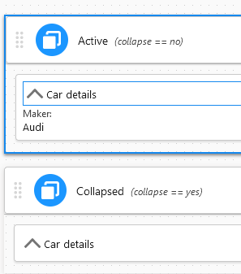
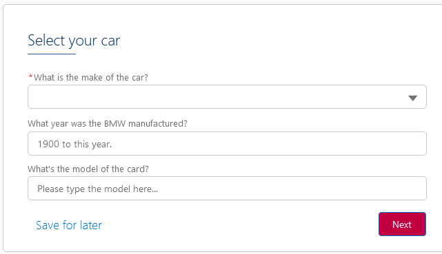
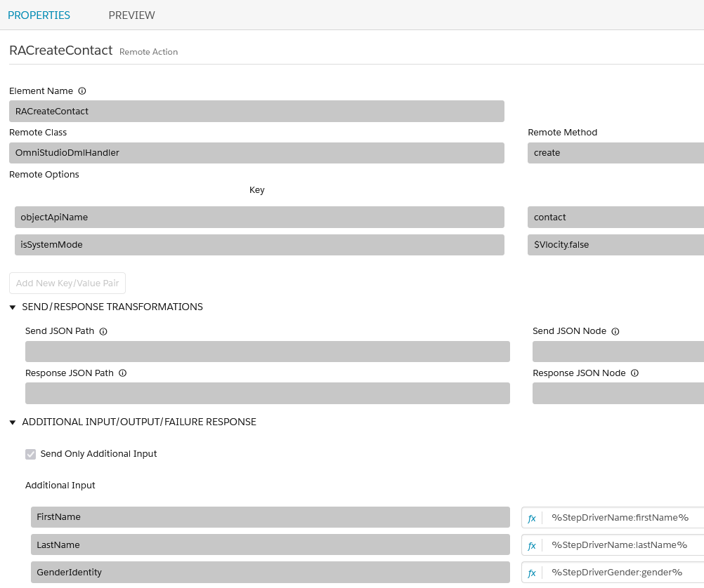
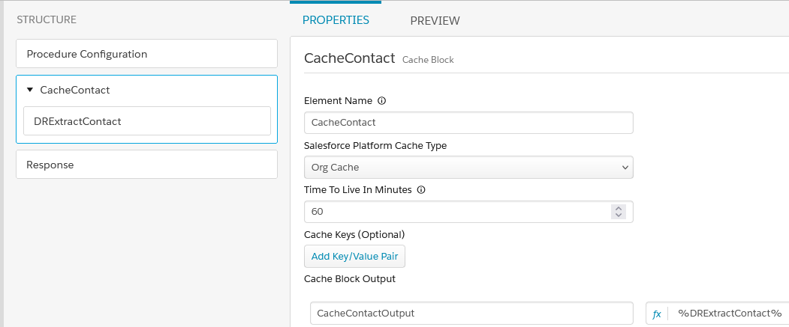
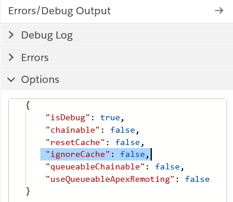
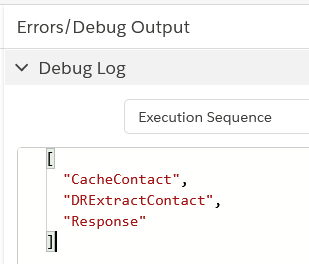

# Salesforce OmniStudio(Vlocity) recipes

-   [Collapse in FlexCard](#collapse-in-flexcard)
-   [Use Data Mapper as FlexCard Data Source](#use-Data Mapper-as-flexcard-data-source)
-   [How to customize OmniStudio styles](#how-to-customize-omnistudio-styles)
-   [OmniStudio DML Handler](#omnistudio-dml-handler)
-   [Cache Block in Integration Procedure](#cache-block-in-integration-procedure)

Please also check out [YouTube playlist](https://www.youtube.com/playlist?list=PL_7QTUl9lWwCE2_t-HGSKiaBBgbDdrLys) for some of recipes listed here.

## Collapse in FlexCard

This [sample](source/omnistudio/main/default/omniUiCard/CarSummary_ApexForcePtyLtd_1.ouc-meta.xml) shows how to collapse whole FlexCard using the 'set value' action.

This can be useful if you use FlexCard in OmniScript as summary.

## Use Data Mapper as FlexCard Data Source

This [sample](source/omnistudio/main/default/omniUiCard/DRAsDataSource_ApexForcePtyLtd_1.ouc-meta.xml) shows how to use Data Mapper as FlexCard Data Source, and filter by an input map.

## How to customize OmniStudio styles

This [sample](source/omnistudio/main/default/omniScripts/ApexForcePtyLtd_CarInsuranceQuote_English_2.os-meta.xml) shows how to use static resource to customize style in OmniStudio.

You can also use your CSS in text block.

## OmniStudio DML Handler

As OmniStudio is running in user mode, which is limited to access data in with sharing mode like Apex. This [sample apex](source/omnistudio/classes/OmniStudioDmlHandler.cls) and [sample OmniScript](source/omnistudio/main/default/omniScripts/ApexForcePtyLtd_CarInsuranceQuote_English_2.os-meta.xml) shows how to handle DML in user mode(with sharing) or system mode(without sharing).

It support dynamic fields and values.

Please note this code gaves you idea how to do it, but it's not something ready to use in your production enviroment.

## Cache Block in Integration Procedure

Cache can improve the performace a lot!

Cache Block in Integration Procedure

Please make sure ignoreCache is set to false before you preview.

You will notice the first time Execution Sequence has DRExtractContact, but not in second time.

Please ref https://help.salesforce.com/s/articleView?id=sf.os_cache_for_dataraptors_and_integration_procedures.htm&type=5 to clear cache.
