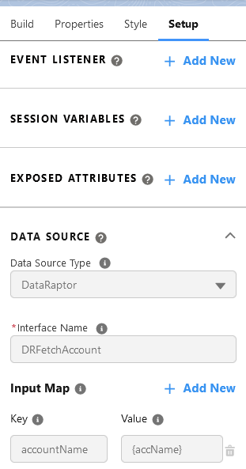

# Salesforce OmniStudio(Vlocity) recipes

## Collapse in FlexCard
This [example](source/omnistudio/main/default/omniUiCard/CarSummary_ApexForcePtyLtd_1.ouc-meta.xml) shows how to collapse FlexCard just like OmniScript.

## Use DataRaptor as FlexCard Data Source
This [example](source/omnistudio/main/default/omniUiCard/DRAsDataSource_ApexForcePtyLtd_1.ouc-meta.xml) shows how to use DataRaptor as FlexCard Data Source, and filter by an input map.

## How to custom OmniStudio style
This [example](source/omnistudio/main/default/omniScripts/ApexForcePtyLtd_CarInsuranceQuote_English_2.os-meta.xml) shows how to use static resource to custom style in OmniStudio.

