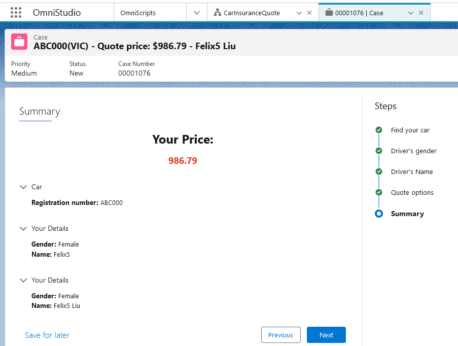
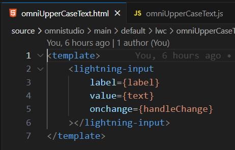

# Salesforce OmniStudio(Vlocity) recipes

-   [Collapse in FlexCard](#collapse-in-flexcard)
-   [Use Data Mapper as FlexCard Data Source](#use-data-mapper-as-flexcard-data-source)
-   [How to customize OmniStudio styles](#how-to-customize-omnistudio-styles)
-   [OmniStudio DML Handler](#omnistudio-dml-handler)
-   [Cache Block in Integration Procedure](#cache-block-in-integration-procedure)
-   [OmniStudio Car Insurance Quote](#omnistudio-car-insurance-quote)
-   [LWC for OmniScript sample ](#lwc-for-omniscript-sample)
-   [Show error message in OmniScript if IP failed](#show-error-message-in-omniscript-if-ip-failed)

Please also check out [YouTube playlist](https://www.youtube.com/playlist?list=PL_7QTUl9lWwCE2_t-HGSKiaBBgbDdrLys) for some of recipes listed here.

## Helpful Links

[OmniStudio Exercise Guides](https://trailhead.salesforce.com/trailblazer-community/feed/0D54S00000C5XMGSA3)

[2021 OmniStudio Documentation](https://drive.google.com/file/d/1-mIX4lrMWwDHCqgOuTqztvrbPj-2dfzo/view)

## Collapse in FlexCard

This [sample](source/omnistudio/main/default/omniUiCard/CarSummary_ApexForcePtyLtd_1.ouc-meta.xml) shows how to collapse whole FlexCard using the 'set value' action.

This can be useful if you use FlexCard in OmniScript as summary.

## Use Data Mapper as FlexCard Data Source

This [sample](source/omnistudio/main/default/omniUiCard/DRAsDataSource_ApexForcePtyLtd_1.ouc-meta.xml) shows how to use Data Mapper as FlexCard Data Source, and filter by an input map.

## How to customize OmniStudio styles

This [sample](source/omnistudio/main/default/omniScripts/ApexForcePtyLtd_CarInsuranceQuote_English_2.os-meta.xml) shows how to use static resource to customize style in OmniStudio.

You can also use your CSS in text block.

## OmniStudio DML Handler

As OmniStudio is running in user mode, which is limited to access data in with sharing mode like Apex. This [sample apex](source/omnistudio/classes/OmniStudioDmlHandler.cls) and [sample OmniScript](source/omnistudio/main/default/omniScripts/ApexForcePtyLtd_CarInsuranceQuote_English_2.os-meta.xml) shows how to handle DML in user mode(with sharing) or system mode(without sharing).

It support dynamic fields and values.

Please note this code gaves you idea how to do it, but it's not something ready to use in your production enviroment.

## Cache Block in Integration Procedure

Cache can improve the performace a lot!

Cache Block in Integration Procedure

Please make sure ignoreCache is set to false before you preview.

You will notice the first time Execution Sequence has DRExtractContact, but not in second time.

Please ref https://help.salesforce.com/s/articleView?id=sf.os_cache_for_dataraptors_and_integration_procedures.htm&type=5 to clear cache.

## OmniStudio Car Insurance Quote

This is a very sample version of Car Insurance Quote build by OmniStudio(OmniScript, Integration Procedure and Data Mapper).

You can find the code [here](source/omnistudio/main/default/omniScripts/ApexForcePtyLtd_CarInsuranceQuote_English_5.os-meta.xml)

## LWC for OmniScript sample

This is a [sample LWC](source/omnistudio/main/default/lwc/omniUpperCaseText/omniUpperCaseText.js) that demonstrates how to interact with OmniScript, such as loading and saving JSON data.

## Show error message in OmniScript if IP failed

This [OmniScript](source/omnistudio/main/default/omniScripts/ApexForcePtyLtd_CarInsurancePayment_English_1.os-meta.xml) shows that how to display error message from IP after click Next button.

## Group a list/array by one of the item attributes

This [Integration Procedure] (source/omnistudio/datapacks/IPGetAccountGroups.json) demonstrates how a list/array can be grouped by one of the item attributes.
It generates a list of groups, group by the attribute value, and each group contains a list/array of items which shares the same attribute value.

