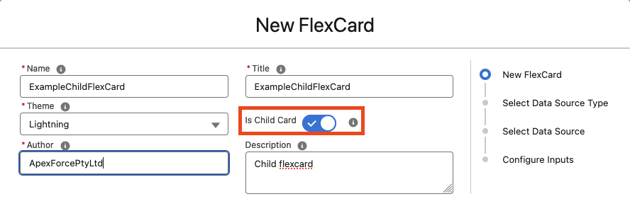
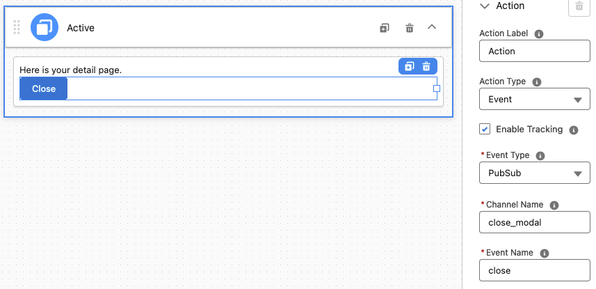
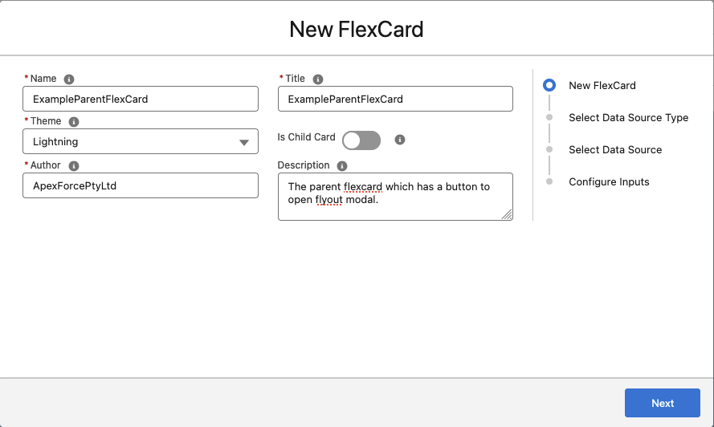
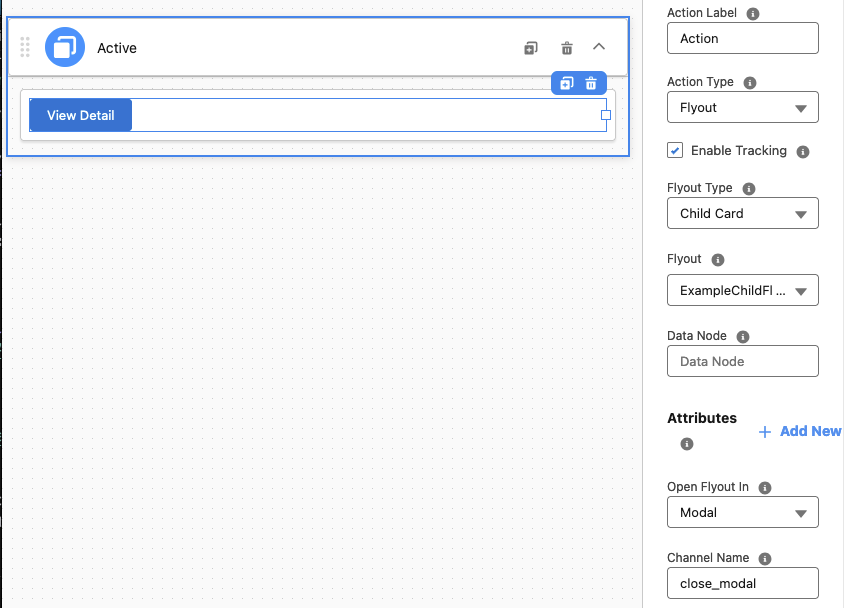
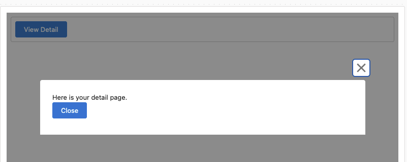

# Omnistudio Help With Example

## Close a Flexcard Flyout Modal from an Action

https://help.salesforce.com/s/articleView?id=sf.os_close_a_flexcard_flyout_modal_from_an_action.htm&type=5

- Create a child FlexCard

- Add an Action Button into the child FlexCard, and active
    - Action Type: Event
    - Event Type: PubSub
    - Event Name: close_modal
    - Event Name: close

- Create a parent FlexCard

- Add an Action Button into the child FlexCard, and active
    - Action Type: Flyout
    - Flyout Type: Child Card
    - Flyout: ExampleChildFlexCard
    - Channel Name: close_modal (same as the Event Name in the child FlexCard)

- Preview the parent FlexCard, and click the "View Detail" Button

    - The child FlexCard will be opened
    - Click the "Close" Button in the child FlexCard